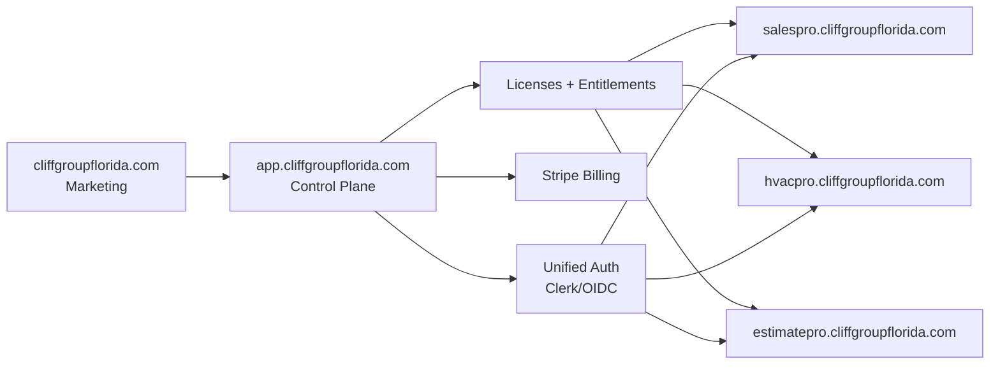
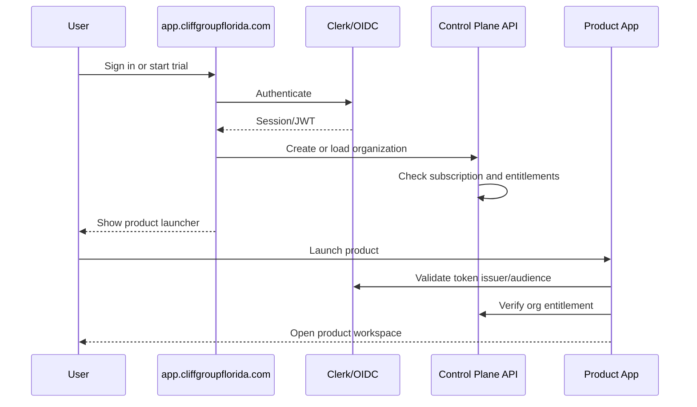
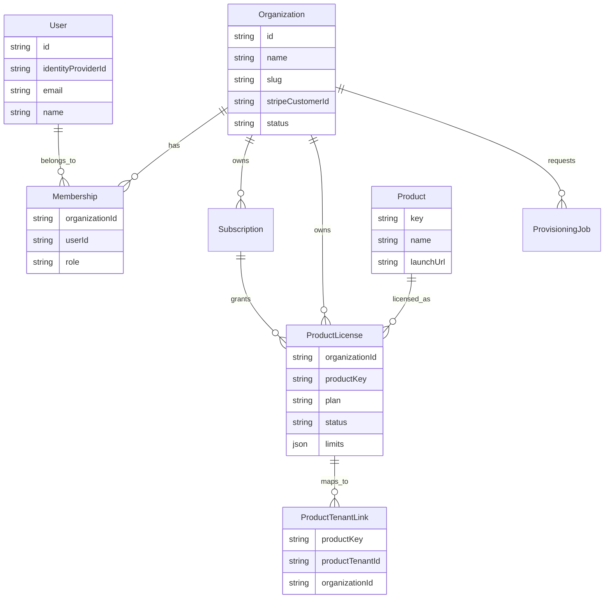
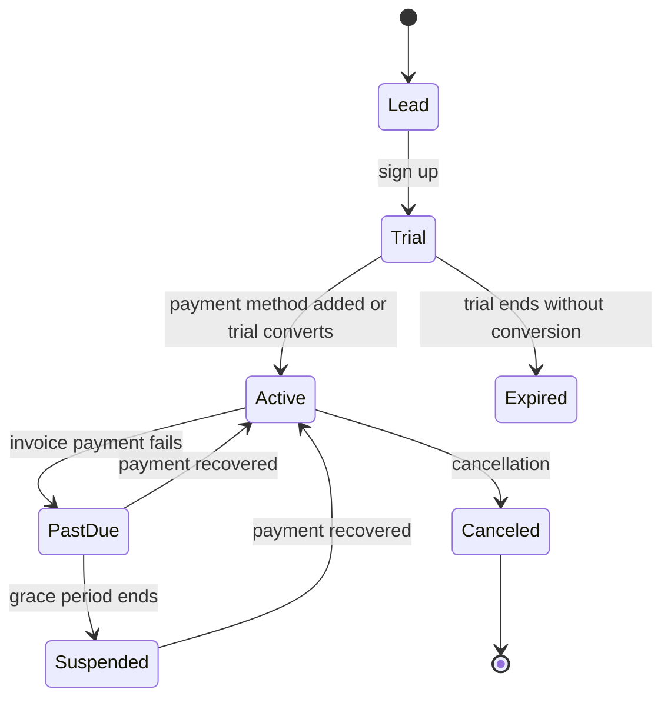
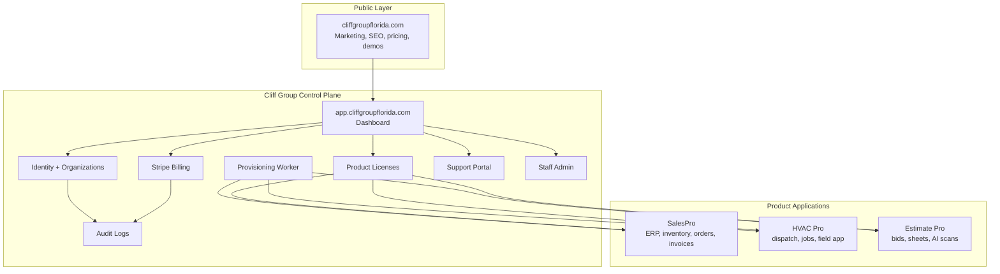

# Cliff Group Florida Platform + SaaS Integration Report

Report date: 2026-05-10  
Workspace analyzed: `/Users/dmytrochashchyn/Documents/Cliffgroup-site`  
Related product apps reviewed at high level: `../Test Sale program/Chat/Revision_7_7`, `../HVAC Pro`, `../Estimate Pro`

## Executive Summary

Cliff Group Florida is currently not deployed as a SaaS platform. The local website is a static single-page marketing prototype built from `index.html` with inline CSS and inline JavaScript. There is no local backend, package manager, build pipeline, authentication, payment checkout, lead delivery, or deployment config in the `Cliffgroup-site` folder.

The live public domain is also not serving this local website. As checked on 2026-05-10, `cliffgroupflorida.com`, `www.cliffgroupflorida.com`, `app.cliffgroupflorida.com`, `salespro.cliffgroupflorida.com`, `hvacpro.cliffgroupflorida.com`, and `estimatepro.cliffgroupflorida.com` all resolve through Porkbun Easy Links and redirect to a parked Porkbun page titled "A Brand New Domain!".

The business direction is clear, though: Cliff Group Florida should become the umbrella company, marketing site, billing portal, onboarding system, and SaaS control plane. SalesPro, HVAC Pro, and Estimate Pro should remain separate product applications, but they need unified auth, organization identity, subscriptions, entitlements, provisioning, and cross-product navigation.

Recommended target architecture:

- `cliffgroupflorida.com`: public marketing website.
- `app.cliffgroupflorida.com`: unified customer dashboard, auth portal, subscription center, product launcher, onboarding, support, and admin control plane.
- `salespro.cliffgroupflorida.com`: SalesPro product app.
- `hvacpro.cliffgroupflorida.com`: HVAC Pro product app.
- `estimatepro.cliffgroupflorida.com`: Estimate Pro product app.
- Centralized Stripe Billing and centralized identity at the Cliff Group control plane.
- Product apps keep domain-specific operational data and workflows.

## 1. Current Website Architecture

### Architecture Verdict

| Area | Current state |
| --- | --- |
| Website type | Static single-page marketing prototype |
| Framework | None in the Cliff Group website folder |
| React | Not used by the website |
| Next.js | Not used |
| SPA | Not a framework SPA; it is a static page with modal/interactions |
| SSR | No |
| Backend | No backend in this folder |
| API | No website API |
| Auth | No website auth |
| Payments | No website payment integration |
| Forms | Frontend-only forms that reset and show toast messages |
| Deployment config | None found |
| Git repo | No `.git` directory in `Cliffgroup-site` |
| Live domain | Parked/redirected via Porkbun Easy Links, not serving the local site |

### Local File Structure

| Path | Purpose |
| --- | --- |
| `index.html` | Main and only active website page. Contains HTML, CSS, product sections, contact forms, modals, and inline JavaScript. |
| `app.js` | Separate interaction script, but not referenced by `index.html`. Appears to be an older or unused version of the inline script. |
| `shots/variant-a.png` | Screenshot/preview asset. |
| `uploads/*.png` | Uploaded visual assets, not referenced by the active HTML. |
| `.DS_Store` | macOS metadata, should not be deployed. |

### Frontend Architecture

The frontend is a fully static HTML document:

- Metadata and Google Font loading are in `index.html`.
- CSS is embedded inside a large `<style>` block.
- JavaScript is embedded in a closing `<script>` block.
- Navigation uses anchor links: `#products`, `#why`, `#preview`, and `#contact`.
- Product "Explore product" cards use `data-product` attributes to open a modal.
- CTA buttons use `data-modal="demo"` and `data-modal="trial"` to open modal forms.
- Form submission is intercepted by JavaScript and never leaves the browser.
- Cookie preference state is stored in `localStorage`.

Key current UI sections:

| Section | Current behavior |
| --- | --- |
| Header/nav | Sticky nav with product, why, preview, contact anchors plus demo/trial buttons. |
| Hero | Public marketing message for HVAC, sales, dispatch, estimates. |
| KPI strip | Animated fake or marketing metrics. |
| Products | Three cards for SalesPro, HVAC Pro, and Estimate Pro. |
| Why Cliff Group | Value prop cards. |
| Preview | Mock HVAC Pro dashboard and mobile view. |
| Contact | Static contact details and frontend-only contact form. |
| Demo modal | Frontend-only demo form. |
| Trial modal | Frontend-only trial form. |
| Product modal | Static feature list and generated mock UI per product. |
| Cookie banner | Local browser preference only. No real analytics integration exists in the local site. |

### Backend Architecture

There is no backend in `Cliffgroup-site`.

Missing backend capabilities:

- No API server.
- No database.
- No authentication service.
- No session management.
- No lead capture endpoint.
- No email delivery.
- No Stripe checkout.
- No Stripe webhooks.
- No onboarding workflow.
- No customer/account model.
- No product provisioning.
- No billing portal.

### Hosting and Deployment

No deployment files exist in the website folder:

- No `package.json`.
- No `vite.config`.
- No `next.config`.
- No `vercel.json`.
- No `netlify.toml`.
- No `wrangler.toml`.
- No `Dockerfile`.
- No `.github/workflows`.
- No `.env` or `.env.example`.

This means the local website can be hosted only as raw static HTML unless a deployment wrapper is added.

### Live Domain Configuration

External checks on 2026-05-10 showed:

| Host | Observed result |
| --- | --- |
| `cliffgroupflorida.com` | A records: `44.230.85.241`, `52.33.207.7`; HTTP 302 to `https://cliffgroupflorida-com.l.ink/` |
| `www.cliffgroupflorida.com` | CNAME to `uixie.porkbun.com`, then same Porkbun IPs and redirect |
| `app.cliffgroupflorida.com` | CNAME to `uixie.porkbun.com`, then same Porkbun IPs and redirect |
| `salespro.cliffgroupflorida.com` | CNAME to `uixie.porkbun.com`, then same Porkbun IPs and redirect |
| `hvacpro.cliffgroupflorida.com` | CNAME to `uixie.porkbun.com`, then same Porkbun IPs and redirect |
| `estimatepro.cliffgroupflorida.com` | CNAME to `uixie.porkbun.com`, then same Porkbun IPs and redirect |
| Nameservers | Porkbun nameservers: `maceio`, `salvador`, `curitiba`, `fortaleza` |
| Live final page | Porkbun Easy Links parked page: "A Brand New Domain!" |

Conclusion: the public domain is registered and reachable, but production hosting for the Cliff Group website and SaaS apps is not configured yet.

### Dependencies, Packages, Frameworks, APIs, Integrations

Current `Cliffgroup-site` dependencies:

| Type | Dependency |
| --- | --- |
| External font | Google Fonts: Fraunces and Inter |
| Browser APIs | DOM API, IntersectionObserver, localStorage, requestAnimationFrame |
| JavaScript libraries | None |
| CSS framework | None |
| Build tools | None |
| API integrations | None |
| Payment integrations | None |
| Auth integrations | None |
| Analytics | Text claims cookies are used for analytics, but no analytics script exists in local code |

Related product app dependencies observed outside the website folder:

| Product | Stack observed |
| --- | --- |
| SalesPro | FastAPI, Uvicorn, SQLAlchemy, python-jose JWT, passlib, Jinja2, httpx, openpyxl, reportlab, PostgreSQL-ready via psycopg, Railway config |
| HVAC Pro | Monorepo: Express API, React/Vite frontend, Expo mobile, shared package, worker, cron, Prisma/PostgreSQL, Stripe, Twilio, SendGrid, QuickBooks, OpenAI |
| Estimate Pro | React/Vite frontend, Clerk auth, React Router, TanStack Query, Express backend, Prisma/PostgreSQL, Clerk backend, Stripe, Cloudflare R2, Anthropic, Redis/BullMQ, Resend, PDF/image tooling |

## 2. Website Purpose + Business Flow

### Current Business Purpose

The current website is a marketing and positioning page for Cliff Group Florida as a software company offering three products:

- SalesPro: business management, ERP, inventory, orders, invoices.
- HVAC Pro: field operations, dispatch, scheduling, technician flow.
- Estimate Pro: bid management, sheet upload, AI scan, takeoff-to-estimate workflow.

The site communicates that products can be purchased individually and combined later. It positions Cliff Group as an umbrella vendor for business automation and HVAC software.

### Current Marketing Pages

There are no separate pages. All public content lives in one HTML file with anchor sections:

| Page/section | Present? | Notes |
| --- | --- | --- |
| Home/hero | Yes | Main product positioning. |
| Product pages | Partial | Product cards and modals only. No dedicated URLs. |
| Pricing | No | No plan cards, prices, billing terms, or packaging. |
| Contact/demo | Partial | Frontend-only forms. |
| Customer onboarding | Mock only | "Create my workspace" text exists, but no actual workspace creation. |
| Support/contact | Partial | Contact details shown. No support portal. |
| Account management | No | No login, account, billing, or organization management. |
| Legal/security | Placeholder links | Footer has `#` links for Terms, Privacy, Security. |

### Current Visitor Journey

1. Visitor lands on static marketing homepage.
2. Visitor sees umbrella positioning and three products.
3. Visitor can click a product card and read a modal.
4. Visitor can click "Start free trial", "Start trial", "Request demo", or "Book a demo".
5. Visitor fills a form.
6. The browser resets the form and shows a toast.
7. No lead is stored, emailed, routed to CRM, or converted into an account.

### Current Sales Funnel

| Funnel step | Current implementation | Gap |
| --- | --- | --- |
| Awareness | Good single-page messaging and product cards | Needs deployment and real SEO metadata/content pages |
| Interest | Product modals explain features | Needs dedicated product pages and proof |
| Intent | Demo/trial CTAs exist | Forms do not submit anywhere |
| Conversion | Trial form says "Create my workspace" | No auth, account, billing, tenant, or provisioning |
| Activation | No real onboarding | Needs workspace setup and product selection |
| Expansion | Copy says "add the rest" | Needs license and subscription management |
| Retention/support | Contact copy only | Needs support portal, docs, billing portal, ticketing |

### Current CTA Structure

Primary CTAs:

- "Start trial"
- "Start free trial"
- "Create my workspace"

Secondary CTAs:

- "Request demo"
- "Book a demo"
- "Send message"
- "Explore product"

Recommendation: keep the CTA language, but connect it to a real conversion system:

- Demo requests -> lead endpoint -> CRM/email notification -> calendar scheduling.
- Trial starts -> Clerk/identity sign-up -> organization creation -> Stripe trial subscription -> product license -> provisioning job.
- Product exploration -> dedicated product URLs for SEO and analytics.

## 3. SalesPro / HVAC Pro / Estimate Pro Integration

### Current Website References

| Product | Current website reference | Current integration depth |
| --- | --- | --- |
| SalesPro | Product card, floating tag, product modal, footer placeholder link | Static marketing only |
| HVAC Pro | Product card, preview mock dashboard, product modal, footer placeholder link | Static marketing only |
| Estimate Pro | Product card, floating tag, product modal, footer placeholder link | Static marketing only |

There are no real links to product apps. Footer product links are `href="#"`. Product cards open modals instead of navigating to product pages or subdomains.

### Current Related Product Architecture

| Product | Current app architecture observed | Current auth | Current billing/payment |
| --- | --- | --- | --- |
| SalesPro | FastAPI monolith with static server-rendered UI, PostgreSQL-ready, Railway config | Local username/password with JWT bearer token | Stripe invoice payment support for end-customer invoice payments |
| HVAC Pro | Node monorepo: Express API, React/Vite web dashboard, Expo mobile, Prisma/PostgreSQL, worker/cron | Local email/password, access token and refresh token | Stripe Checkout for customer invoice payments, Stripe webhooks, SendGrid/Twilio, QuickBooks |
| Estimate Pro | React/Vite frontend plus Express backend, Prisma/PostgreSQL, Clerk, R2, Redis/BullMQ | Clerk auth | Stripe subscription webhooks tied to user plan and AI scan quota |

### Integration Problems

The three products are not currently unified:

- Different auth systems.
- Different user/account models.
- Different billing meanings.
- No central organization object.
- No shared entitlement/license model.
- No product launcher.
- No unified onboarding flow.
- No cross-product navigation.
- No unified support or admin view.
- No shared customer portal identity.

Important billing distinction:

- SalesPro and HVAC Pro Stripe usage appears oriented around their customers' invoice payments.
- Estimate Pro Stripe usage appears oriented around SaaS subscription plans.
- Cliff Group control plane should own SaaS subscriptions. Product apps may still process tenant-owned invoice/customer payments, but those should be separated from platform subscription billing.

### Ideal Product Architecture

Keep products independent at the application layer, but centralize identity, billing, organizations, and entitlements.

| Layer | Owner | Responsibility |
| --- | --- | --- |
| Public brand and product marketing | Cliff Group website | SEO, product pages, pricing, demo/trial CTAs |
| Auth and account | Cliff Group control plane | Sign-up, login, organizations, roles, SSO, invitations |
| Billing | Cliff Group control plane | Stripe customers, subscriptions, trials, invoices, portal |
| Product licensing | Cliff Group control plane | Which org can access which products, plan limits |
| Provisioning | Cliff Group control plane | Create product tenant records and initial admins |
| Operational workflows | Product apps | SalesPro, HVAC Pro, Estimate Pro business logic |
| Product data | Product apps | Domain-specific operational data |
| Reporting/meta-admin | Cliff Group control plane | Subscription state, account health, product launch links |

### Ideal Product Navigation

Recommended global navigation after login:

- Dashboard
- Products
- Billing
- Team
- Onboarding
- Support
- Security
- Admin

Product app header should include:

- Cliff Group logo.
- Product name.
- Organization switcher.
- App switcher: SalesPro, HVAC Pro, Estimate Pro, Billing, Support.
- User menu powered by unified identity.

### Ideal App Access Structure



## 4. SaaS Control Plane Readiness

### Readiness Assessment

| Capability | Current Cliff website readiness | Notes |
| --- | --- | --- |
| Account creation | Not ready | Trial form is frontend-only. |
| Organization management | Not ready | No organization model. |
| Subscription management | Not ready | No Stripe Billing integration in website. |
| Billing management | Not ready | No billing portal. |
| Centralized auth | Not ready | No auth layer. |
| Tenant provisioning | Not ready | No provisioning jobs or product APIs. |
| Product licensing | Not ready | No entitlement model. |
| Customer portal | Not ready | No account portal. |
| Support portal | Not ready | Contact text only. |
| Lead capture | Not ready | Forms do not submit to backend. |
| Admin control plane | Not ready | No staff/admin interface. |

### What Must Be Added

Minimum SaaS control plane components:

- Backend API for leads, accounts, organizations, product licenses, subscriptions, provisioning, support, and audit logs.
- Database with organization, membership, product, plan, entitlement, subscription, and provisioning models.
- Unified identity provider.
- Stripe Billing integration.
- Stripe webhook processing.
- Product provisioning APIs or event consumers.
- App launcher and product access checks.
- Organization invitations and role-based access.
- Admin console for Cliff Group staff.
- Support/ticket intake.
- Transactional email.
- Security headers, rate limiting, and audit logging.

### What Should Remain Separate

Keep these inside product apps:

- SalesPro operational data: customers, products, inventory, orders, invoices, shipments, returns, purchase orders.
- HVAC Pro operational data: customers, locations, equipment, jobs, dispatch, technician workflows, invoices.
- Estimate Pro operational data: projects, sheets, takeoffs, AI scan results, bid requests, pricing overrides.
- Product-specific background workers.
- Product-specific integrations that belong to the tenant's operation, such as QuickBooks sync, invoice payment collection, Twilio notifications, and sheet processing.

### What Should Become Centralized

Centralize these in Cliff Group:

- Authentication and SSO.
- Organization identity.
- Memberships and roles at the account level.
- Product entitlements and plan limits.
- Subscription billing.
- Billing portal.
- Trial lifecycle.
- Tenant provisioning status.
- Product launcher.
- Support and account health.
- Staff admin controls.
- Audit logs for account, billing, and provisioning events.

## 5. Authentication + User Flow

### Current Website Auth

The Cliff Group website has no authentication system:

- No login page.
- No sign-up flow.
- No tokens.
- No sessions.
- No protected routes.
- No user management.
- No organization switcher.
- No password reset.
- No SSO.

### Product App Auth Observed

| Product | Auth pattern |
| --- | --- |
| SalesPro | Local user table, username/password, JWT access token, role levels: sales, manager, admin |
| HVAC Pro | Local user table, email/password, access token, refresh token stored as hashed session, roles, bearer auth middleware |
| Estimate Pro | Clerk frontend provider, Clerk backend token verification, local user row keyed by Clerk ID |

### Recommended Centralized Auth Strategy

Fastest path: standardize on Clerk Organizations or an equivalent OIDC provider because Estimate Pro already uses Clerk.

Recommended identity design:

- Use `app.cliffgroupflorida.com` as the unified login and customer portal.
- Use a custom auth domain if available, such as `auth.cliffgroupflorida.com`.
- Use organizations for customer companies.
- Use memberships for users inside organizations.
- Use account-level roles: owner, admin, billing_admin, product_admin, member, support_viewer.
- Use product-level roles mapped per app: SalesPro sales/manager/admin, HVAC Pro technician/office/admin, Estimate Pro estimator/admin.
- Product apps validate the same identity issuer and receive org/product entitlement claims.

### Recommended SSO Architecture



### Best Architecture for `app.cliffgroupflorida.com`

`app.cliffgroupflorida.com` should act as:

- Unified auth portal.
- Customer dashboard.
- Subscription management center.
- Product launcher.
- Onboarding checklist.
- Organization and team management.
- Support intake.
- Staff admin console.

Core route structure:

| Route | Purpose |
| --- | --- |
| `/login` | Unified sign-in |
| `/signup` | Trial or paid sign-up |
| `/onboarding` | Company setup, product selection, data import checklist |
| `/dashboard` | Account health, product access, next actions |
| `/products` | Product launcher and license state |
| `/products/salespro` | SalesPro license and launch |
| `/products/hvacpro` | HVAC Pro license and launch |
| `/products/estimatepro` | Estimate Pro license and launch |
| `/billing` | Current plan, invoices, payment method, Stripe portal |
| `/team` | Organization members and invites |
| `/support` | Tickets, contact, onboarding help |
| `/settings/security` | SSO, MFA, sessions, audit log |
| `/admin` | Cliff Group staff-only control plane |

Recommended account data model:



## 6. Billing + Stripe Architecture

### Current Website Payment Implementation

The Cliff Group website has no payment implementation:

- No Stripe client.
- No checkout endpoint.
- No Stripe Billing portal.
- No webhook route.
- No price IDs.
- No plan table.
- No subscription lifecycle.

### Product App Payment/Billing Observed

| Product | Current Stripe use |
| --- | --- |
| SalesPro | Stripe Checkout for invoice/customer portal payments. It supports payment gateway profiles and verifies Stripe webhook signatures. |
| HVAC Pro | Stripe Checkout for public invoice payments and Stripe webhook processing for checkout completion. |
| Estimate Pro | Stripe subscription webhooks update user plan, price ID, customer ID, and period end. |

### Recommended Centralized Stripe Billing Architecture

Cliff Group should own SaaS billing centrally:

- One Stripe Customer per Cliff Group organization.
- One active SaaS subscription per organization.
- Subscription items represent licensed products or bundles.
- Product entitlements are derived from Stripe subscription state.
- Stripe webhooks go to the control plane first.
- Product apps receive entitlement updates from the control plane, not directly from Stripe.
- Stripe Billing Portal is launched only from `app.cliffgroupflorida.com`.

Recommended Stripe objects:

| Stripe object | Use |
| --- | --- |
| Customer | Cliff Group customer organization |
| Product | SalesPro, HVAC Pro, Estimate Pro, bundles, add-ons |
| Price | Monthly/annual tiers and add-ons |
| Subscription | Organization subscription |
| Subscription item | Product license/tier |
| Checkout Session | Trial start or paid signup |
| Billing Portal Session | Self-service billing |
| Webhook event | Source of truth for subscription status changes |

### Subscription Lifecycle



### Recommended Plans

Start simple:

| Plan | Products | Purpose |
| --- | --- | --- |
| Starter | One product | Low-friction entry |
| Professional | One product with higher limits | Primary SMB plan |
| Suite | All products | Cross-sell and bundled value |
| Enterprise | Custom | SSO, data migration, custom terms |

Product-specific add-ons:

- Extra users.
- Extra locations/warehouses.
- Extra technicians.
- Extra AI scans.
- Extra storage.
- Premium support.
- Implementation package.

### What Belongs Where

| Capability | Cliff Group control plane | SalesPro | HVAC Pro | Estimate Pro |
| --- | --- | --- | --- | --- |
| SaaS subscription checkout | Yes | No | No | No |
| SaaS billing portal | Yes | No | No | No |
| Subscription webhooks | Yes | No, except legacy migration | No, except legacy migration | Migrate to control plane |
| Entitlements | Yes | Enforce locally from control plane | Enforce locally from control plane | Enforce locally from control plane |
| Tenant/customer invoice payments | Optional platform policy | Yes | Yes | Usually no |
| Stripe Connect for tenants | Later | Possible | Possible | Not required initially |
| Tenant operational invoices | No | Yes | Yes | No |
| Product plan limits | Defines source of truth | Enforces | Enforces | Enforces |

### Important Billing Rule

Do not mix Cliff Group SaaS subscription billing with tenant end-customer invoice payment processing in the same data model. If the same Stripe account is used initially, enforce strict metadata, separate webhook handlers, separate price/product namespaces, and clear reporting. The safer scaling strategy is separate Stripe accounts or Stripe Connect for tenant merchant payments.

## 7. Domain + Subdomain Strategy

### Current Domain State

All tested public and product subdomains currently point to Porkbun Easy Links and redirect to a parked page. None of the SaaS product routes are live under the intended domains.

### Recommended Production Domain Architecture

| Domain | Recommended role | Recommended host |
| --- | --- | --- |
| `cliffgroupflorida.com` | Public marketing website | Cloudflare Pages or Vercel |
| `www.cliffgroupflorida.com` | Redirect to apex | Cloudflare redirect rule |
| `app.cliffgroupflorida.com` | Control plane, auth entry, billing, onboarding | Vercel/Next.js or dedicated app service |
| `api.cliffgroupflorida.com` | Control plane API if separated from frontend | Railway/Fly/Render/AWS |
| `salespro.cliffgroupflorida.com` | SalesPro app | Railway/Fly/Render/AWS |
| `hvacpro.cliffgroupflorida.com` | HVAC Pro web app | Vercel/Cloudflare Pages plus API backend |
| `api.hvacpro.cliffgroupflorida.com` | HVAC Pro API | Railway/Fly/Render/AWS |
| `estimatepro.cliffgroupflorida.com` | Estimate Pro web app | Vercel/Cloudflare Pages |
| `api.estimatepro.cliffgroupflorida.com` | Estimate Pro API | Railway/Fly/Render/AWS |
| `cdn.cliffgroupflorida.com` | Shared static/media CDN | Cloudflare R2/CDN |
| `status.cliffgroupflorida.com` | Public status page | Better Stack/UptimeRobot/Statuspage |
| `support.cliffgroupflorida.com` | Support portal/docs | Helpdesk/docs platform or control plane route |

### Customer-Specific Subdomains

Recommended initial approach:

- Use organization slugs inside the app first: `app.cliffgroupflorida.com/org/acme`.
- Add customer-specific subdomains later only when needed: `acme.app.cliffgroupflorida.com`.
- For product deep links, prefer signed product launch URLs with organization context.

If customer subdomains are required:

- Add wildcard DNS: `*.app.cliffgroupflorida.com`.
- Validate org slugs before issuing subdomains.
- Use Cloudflare wildcard certificate.
- Avoid separate app deployments per customer unless enterprise isolation is required.

### Auth Routing

Recommended:

- Login starts at `app.cliffgroupflorida.com/login`.
- Product apps redirect unauthenticated users to `app.cliffgroupflorida.com/login?return_to=...`.
- After login, the control plane validates product entitlement and returns the user to the product app.
- Product apps should not own independent public sign-up pages.

### API Routing

Recommended:

- Control plane API: `/api` under `app.cliffgroupflorida.com` for a Next.js full-stack app, or `api.cliffgroupflorida.com` if using a separate backend.
- Product APIs use product-specific subdomains.
- Webhook endpoints should be stable, separate, and not protected by user auth:
  - `api.cliffgroupflorida.com/webhooks/stripe`
  - `api.cliffgroupflorida.com/webhooks/clerk`
  - `api.salespro.cliffgroupflorida.com/webhooks/stripe-payments`
  - `api.hvacpro.cliffgroupflorida.com/webhooks/stripe-payments`

### DNS and Cloudflare Setup

Recommended Cloudflare setup:

- Move authoritative DNS from Porkbun nameservers to Cloudflare, or keep Porkbun registrar with Cloudflare nameservers.
- Enable SSL/TLS Full (strict).
- Enable HSTS after all subdomains are properly deployed.
- Proxy public web/app/API hosts through Cloudflare where compatible.
- Use WAF managed rules.
- Add rate limiting on login, form, and webhook-adjacent endpoints.
- Add Turnstile to public forms.
- Configure DNS records explicitly rather than wildcarding every product host to the same parked page.

## 8. Deployment + Infrastructure

### Current Deployment Strategy

The Cliff Group website folder has no deployment strategy. It can be opened locally as static HTML, but there is no production pipeline.

Current live domain deployment is Porkbun Easy Links parked hosting, not the local website.

### Product Deployment Readiness Observed

| Product | Deployment evidence |
| --- | --- |
| SalesPro | Railway config, Procfile, FastAPI app reads `PORT`, PostgreSQL-ready |
| HVAC Pro | Node monorepo with frontend, API, mobile, shared, worker, cron; no production deploy config found in quick review |
| Estimate Pro | Frontend/backend split with env examples for Neon, R2, Redis, Clerk, Stripe; no production deploy config found in quick review |

### Recommended Deployment Architecture

| Component | Recommended hosting |
| --- | --- |
| Marketing site | Cloudflare Pages or Vercel static/Next.js |
| Control plane frontend/API | Next.js on Vercel, or React frontend plus Node/Fastify API on Railway/Fly |
| Control plane database | Neon Postgres, Supabase Postgres, RDS, or Railway Postgres |
| Product APIs | Railway/Fly/Render/AWS ECS depending on scale |
| Product frontends | Vercel or Cloudflare Pages |
| Workers/cron | Railway workers, Fly machines, or managed queues |
| Object storage | Cloudflare R2 or S3 |
| Queue | Upstash Redis, managed Redis, or SQS |
| Email | Resend or SendGrid |
| Monitoring | Sentry plus Better Stack/UptimeRobot |
| Backups | Automated database snapshots plus object storage lifecycle policies |

### Staging and Production Separation

Use separate environments:

| Environment | Domains |
| --- | --- |
| Local | `localhost` and `127.0.0.1` |
| Preview | Per-PR preview URLs |
| Staging | `staging.cliffgroupflorida.com`, `staging-app.cliffgroupflorida.com`, product staging subdomains |
| Production | Public domains listed above |

Each environment needs separate:

- Databases.
- Stripe mode/accounts.
- Clerk instance or environment.
- Webhook secrets.
- Storage buckets.
- Email sending domain.
- API keys.

### CI/CD Readiness

Recommended GitHub Actions:

- Lint.
- Typecheck.
- Unit tests.
- Build.
- Database migration dry run.
- Security/dependency audit.
- Deploy preview.
- Deploy production from protected branch/tags.

For the current `Cliffgroup-site`, first create a real Git repo or move it into the platform repo, then add a minimal static deployment workflow.

### Scaling Strategy

Phase 1:

- Static marketing site.
- Single control plane app.
- Managed Postgres.
- Stripe Billing.
- Manual/semi-automated provisioning.

Phase 2:

- Product APIs behind dedicated subdomains.
- Shared identity.
- Event-based entitlement sync.
- Background provisioning workers.

Phase 3:

- Tenant isolation options.
- Dedicated product workers.
- Queue-based imports and AI jobs.
- Central observability and audit.

## 9. Security Audit

### Current Website Security Findings

| Area | Current state | Risk |
| --- | --- | --- |
| Secrets | No secrets in website folder | Good for static site |
| Auth | None | Cannot protect account/billing/product routes |
| Forms | Frontend-only | No data captured, no validation server-side, no spam control |
| Payments | None | Cannot sell subscriptions |
| CSP | None in local static page | Add security headers at host/CDN |
| XSS | Product modal uses `innerHTML` with static local strings | Low now, high if later fed user/CMS content |
| CSRF | No backend forms | Not applicable yet |
| Uploads | No active upload endpoint | Not applicable for website |
| Dependencies | No package dependencies | Low dependency attack surface |
| Analytics/cookies | Cookie banner claims analytics, but no analytics code | Compliance mismatch if analytics is added later |
| Deployment | Live parked page | Brand/security issue; not SaaS-ready |

### Product Security Notes

| Product | Observed posture |
| --- | --- |
| SalesPro | Has JWT secret enforcement, role checks, security headers, webhook target validation, Stripe webhook signature verification. Needs central identity migration and production secret management. |
| HVAC Pro | Has bearer auth, hashed refresh token sessions, CORS config, raw Stripe webhook body, Stripe signature verification. `CORS_ORIGIN` defaults to `*`, so production must set strict origins. |
| Estimate Pro | Uses Clerk auth and helmet, Stripe and Clerk webhook signature verification. Backend currently logs token prefix and manually reads `.env`; remove sensitive auth logging and harden env loading for production. |

### SaaS-Grade Hardening Recommendations

Required controls:

- HTTPS everywhere.
- Cloudflare SSL Full (strict).
- HSTS after deployment is stable.
- CSP for marketing and apps.
- `X-Frame-Options` or `frame-ancestors`.
- `X-Content-Type-Options: nosniff`.
- `Referrer-Policy`.
- Rate limiting for login, forms, public portal, and checkout endpoints.
- Turnstile or equivalent on public forms.
- Strict CORS allowlists.
- Signed webhooks with raw body validation.
- Central secret manager or host-managed encrypted environment variables.
- No secrets committed to Git.
- Audit logs for login, billing, role changes, product provisioning, support admin actions.
- MFA for Cliff Group staff and customer admins.
- Principle-of-least-privilege product tokens.
- Dependency scanning and lockfile enforcement.
- Error reporting that redacts tokens and PII.

### Security Headers for Marketing Site

Minimum:

```text
Content-Security-Policy: default-src 'self'; script-src 'self'; style-src 'self' 'unsafe-inline' https://fonts.googleapis.com; font-src 'self' https://fonts.gstatic.com; img-src 'self' data: https:; connect-src 'self'; frame-ancestors 'none'; base-uri 'self'; form-action 'self'
X-Content-Type-Options: nosniff
Referrer-Policy: strict-origin-when-cross-origin
Permissions-Policy: geolocation=(), microphone=(), camera=()
```

Adjust CSP if analytics, scheduling widgets, or embedded demos are added.

## 10. Control Plane Architecture

### Long-Term Architecture

Cliff Group Florida should become the platform layer. SalesPro, HVAC Pro, and Estimate Pro should become product applications connected to the platform through identity, entitlements, billing, and provisioning.



### Control Plane Services

| Service | Responsibility |
| --- | --- |
| Identity service | Auth provider integration, users, organizations, memberships |
| Billing service | Stripe checkout, portal, webhooks, subscription state |
| Entitlement service | Product licenses, limits, plan mapping |
| Provisioning service | Creates product tenant records and links them to orgs |
| Product registry | Product metadata, launch URLs, status, plan requirements |
| Support service | Tickets, onboarding requests, account support |
| Notification service | Email/SMS for onboarding, billing, support |
| Admin service | Internal Cliff Group management |
| Audit service | Immutable log of sensitive account/platform actions |

### Product Integration Contract

Each product should implement:

| Contract | Purpose |
| --- | --- |
| `GET /health` | Uptime checks |
| `POST /internal/tenants` | Provision product tenant for an organization |
| `PATCH /internal/tenants/:id/license` | Apply entitlement/plan changes |
| `GET /internal/tenants/:id/status` | Report readiness/status |
| `POST /internal/users/sync` | Sync org members or product roles |
| JWT/OIDC validation | Trust centralized identity |
| Entitlement check | Prevent access without active license |
| Audit callback/event | Report provisioning and access events |

Internal endpoints should require machine-to-machine authentication, not user bearer tokens.

### Migration Plan

| Phase | Goal | Work |
| --- | --- | --- |
| Phase 0 | Put the brand online | Deploy static site, replace Porkbun parked page, configure apex/www |
| Phase 1 | Capture demand | Real demo/contact/trial backend, CRM/email, analytics, product pages, privacy/terms |
| Phase 2 | Launch control plane MVP | Unified auth, org creation, dashboard, Stripe Billing, billing portal, manual product provisioning |
| Phase 3 | Connect products | Add product launcher, entitlement checks, product tenant mapping, SSO redirects |
| Phase 4 | Automate provisioning | Product internal APIs, provisioning worker, lifecycle events, onboarding checklists |
| Phase 5 | SaaS operations | Monitoring, backups, audit logs, support portal, admin console, staging/prod CI/CD |
| Phase 6 | Scale | Customer subdomains, enterprise SSO, tenant isolation, data warehouse, usage billing |

### Rollout Priorities

1. Deploy the marketing site to the real domain.
2. Add real lead capture and trial request routing.
3. Build `app.cliffgroupflorida.com` with auth, organizations, billing, and product launcher.
4. Centralize Stripe subscriptions in the control plane.
5. Migrate Estimate Pro subscription logic to the control plane.
6. Migrate HVAC Pro and SalesPro auth to unified identity.
7. Add automated provisioning and entitlement enforcement.

## 11. Final Recommendation

### Exact Recommended Architecture

Use a hub-and-spoke SaaS model:

- Cliff Group Florida is the hub: marketing, auth, billing, onboarding, support, account management, subscriptions, entitlements, provisioning, admin.
- SalesPro, HVAC Pro, and Estimate Pro are spokes: product-specific applications with their own operational databases and workflows.

Recommended implementation:

| Component | Recommended choice |
| --- | --- |
| Marketing | Static or Next.js site deployed on Cloudflare Pages/Vercel |
| Control plane | Next.js or React + Node API at `app.cliffgroupflorida.com` |
| Control plane DB | PostgreSQL with Prisma |
| Identity | Clerk Organizations/OIDC as fastest path |
| Billing | Stripe Billing in the control plane |
| Product apps | Keep existing stacks, integrate through OIDC/JWT and provisioning APIs |
| DNS/CDN | Cloudflare |
| Storage | Cloudflare R2/S3 |
| Queue | Upstash Redis/BullMQ or managed queue |
| Monitoring | Sentry plus uptime monitoring |
| Email | Resend or SendGrid |

### Fastest Path to Market

1. Deploy current static website to `cliffgroupflorida.com`.
2. Replace all frontend-only forms with real lead capture.
3. Create dedicated product pages for SalesPro, HVAC Pro, Estimate Pro.
4. Launch `app.cliffgroupflorida.com` MVP with auth, org creation, product selection, and Stripe checkout.
5. Start with manual provisioning behind the scenes while product APIs are prepared.
6. Add SSO/product launcher before automating everything.

### Safest Scaling Strategy

- Centralize billing before scaling paid customers.
- Centralize identity before adding cross-product bundles.
- Keep product operational databases separate to avoid a risky big rewrite.
- Use entitlements as the contract between the platform and products.
- Automate provisioning only after manual provisioning rules are stable.
- Keep tenant customer invoice payments separate from Cliff Group SaaS subscription billing.

### Separation of Responsibilities

| Responsibility | Cliff Group Florida | SalesPro | HVAC Pro | Estimate Pro |
| --- | --- | --- | --- | --- |
| Public marketing | Primary owner | Product input | Product input | Product input |
| Pricing | Primary owner | Product limits | Product limits | Product limits |
| SaaS checkout | Primary owner | None | None | None |
| Billing portal | Primary owner | None | None | None |
| Auth | Primary owner | Trust platform | Trust platform | Trust platform |
| Organizations | Primary owner | Tenant mapping | Tenant mapping | Tenant mapping |
| Product data | No | Primary owner | Primary owner | Primary owner |
| Product workflows | No | Primary owner | Primary owner | Primary owner |
| Customer invoice payments | Policy/admin only | Primary owner | Primary owner | Optional/no |
| Support | Primary owner | Product diagnostics | Product diagnostics | Product diagnostics |
| Provisioning | Primary owner | Implement internal endpoint | Implement internal endpoint | Implement internal endpoint |

## Deployment Checklist

- [ ] Create or connect GitHub repository for `Cliffgroup-site`.
- [ ] Remove `.DS_Store` from tracked/deployed files.
- [ ] Decide static hosting provider: Cloudflare Pages or Vercel.
- [ ] Deploy `index.html` to a preview URL.
- [ ] Configure `cliffgroupflorida.com` and `www`.
- [ ] Replace Porkbun Easy Links records.
- [ ] Add redirects from `www` to apex.
- [ ] Add cache policy and security headers.
- [ ] Add CI/CD from protected branch.
- [ ] Add uptime monitoring for apex and app subdomain.

## SaaS Readiness Checklist

- [ ] Define product plans and prices.
- [ ] Define organization model.
- [ ] Define user roles and product role mapping.
- [ ] Build sign-up and login.
- [ ] Build organization creation flow.
- [ ] Build product selection flow.
- [ ] Build Stripe checkout.
- [ ] Build Stripe billing portal.
- [ ] Build subscription webhook handler.
- [ ] Build entitlement table.
- [ ] Build product launcher.
- [ ] Build onboarding checklist.
- [ ] Build manual provisioning admin screen.
- [ ] Build product tenant mapping.
- [ ] Build support intake.
- [ ] Build audit log.

## Infrastructure Checklist

- [ ] Production Postgres for control plane.
- [ ] Staging Postgres for control plane.
- [ ] Object storage bucket for uploads/assets.
- [ ] Redis/queue for provisioning and async work.
- [ ] Transactional email provider.
- [ ] Error monitoring.
- [ ] Logs with retention.
- [ ] Database backup policy.
- [ ] Restore test process.
- [ ] Secrets stored in hosting provider or secret manager.
- [ ] Separate staging and production secrets.
- [ ] Health endpoints for all apps.
- [ ] Background worker monitoring.

## Domain Architecture Checklist

- [ ] Move DNS to Cloudflare or explicitly configure Porkbun DNS records.
- [ ] Apex points to marketing host.
- [ ] `www` redirects to apex.
- [ ] `app` points to control plane.
- [ ] `api` points to control plane API if separate.
- [ ] `salespro` points to SalesPro.
- [ ] `hvacpro` points to HVAC Pro.
- [ ] `estimatepro` points to Estimate Pro.
- [ ] Product API subdomains are configured if needed.
- [ ] `cdn` points to R2/S3 CDN.
- [ ] SPF, DKIM, and DMARC configured for email.
- [ ] HSTS enabled only after all subdomains are ready.
- [ ] Wildcard customer subdomains deferred until needed.

## Security Checklist

- [ ] Enforce HTTPS.
- [ ] Add CSP/security headers.
- [ ] Add strict CORS.
- [ ] Add Turnstile to public forms.
- [ ] Add rate limiting.
- [ ] Add webhook signature verification.
- [ ] Add MFA for staff/admins.
- [ ] Remove sensitive token logging.
- [ ] Add audit logs for auth, billing, role, provisioning events.
- [ ] Add dependency scanning.
- [ ] Add secret scanning.
- [ ] Add secure cookie settings.
- [ ] Add session revocation.
- [ ] Add staff/admin access review process.
- [ ] Add production incident response checklist.

## Production Checklist

- [ ] Public website deployed and replacing parked page.
- [ ] Real contact/demo/trial forms live.
- [ ] Privacy Policy, Terms, Security pages published.
- [ ] Analytics configured with consent policy.
- [ ] Control plane login works.
- [ ] Organization creation works.
- [ ] Stripe checkout works in test mode.
- [ ] Stripe checkout works in live mode.
- [ ] Stripe webhooks tested in live mode.
- [ ] Billing portal works.
- [ ] Product launcher works.
- [ ] Manual provisioning process documented.
- [ ] Product app health checks are monitored.
- [ ] Backups enabled and restore tested.
- [ ] Staff admin accounts secured with MFA.
- [ ] DNS records verified.
- [ ] Uptime alerts configured.
- [ ] Support inbox/ticket routing configured.

